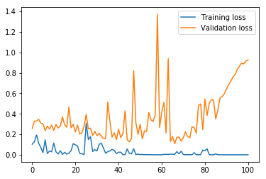
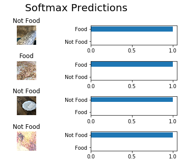

# Food Recognition System For Passio
## By: Sarah Hernandez


```python
import tensorflow as tf
import numpy as np
import pickle
import os
import cv2
import math
from random import shuffle
import matplotlib.pyplot as plt
import skimage
    

```

### Goal 1: Prepare a Dataset:

#### Step 1: Explore Dataset


```python
currentDir = os.getcwd()
foodDir = currentDir + "/Food"
notFoodDir = currentDir + "/Not Food"

foodList = os.listdir(foodDir)
numFoods = 144 #len(foodList), entered original length before data augmentation

notFoodList = os.listdir(notFoodDir)
numNotFoods = 125 #len(notFoodList), entered original length before data augmentation

print("Foods: " + str(numFoods))
print("Not Foods: " + str(numNotFoods))

for i in range(3):
    testDir = foodDir + "/" + foodList[i]
    img = cv2.imread(testDir)
    print("Example Food Shape: " + str(img.shape))
    testDir2 = notFoodDir + "/" + notFoodList[i]
    img2 = cv2.imread(testDir2)
    print("Example Not Food Shape: " + str(img2.shape))
    

```

    Foods: 144
    Not Foods: 125
    Example Food Shape: (640, 640, 3)
    Example Not Food Shape: (4032, 3024, 3)
    Example Food Shape: (480, 640, 3)
    Example Not Food Shape: (3024, 4032, 3)
    Example Food Shape: (612, 612, 3)
    Example Not Food Shape: (640, 360, 3)


So we have fewer than 300 images of food and not food, of various square and rectangular sizes. This is a rather small data set, so we'll augment the data using a few tricks:


#### Step 2: Augment Data


```python
# Get array of directories of food and not food
def get_image_dirs(foodList, notFoodList):
    
    foodDirs = []
    for food in foodList:
        if not food.startswith('.'):
            foodDirs.append(foodDir + "/" + food)
    
    notFoodDirs = []
    for notFood in notFoodList:
        if not notFood.startswith('.'):
            notFoodDirs.append(notFoodDir + "/" + notFood)
        
    
    return foodDirs, notFoodDirs
        

foodDirs, notFoodDirs = get_image_dirs(foodList, notFoodList)


```


```python

# First trick: flip and rotate images
for i in range(numFoods):
    img = cv2.imread(foodDirs[i])
    img2 = np.fliplr(img)
    img3 = np.flipud(img)
    img4 = np.rot90(img)
    cv2.imwrite(foodDir + "/lr" + str(i) + ".jpg", img2)
    cv2.imwrite(foodDir + "/ud" + str(i) + ".jpg", img3)
    cv2.imwrite(foodDir + "/rot90" + str(i) + ".jpg", img4)
    
for i in range(numNotFoods):
    img = cv2.imread(notFoodDirs[i])
    img2 = np.fliplr(img)
    img3 = np.flipud(img)
    img4 = np.rot90(img)
    cv2.imwrite(notFoodDir + "/lr" + str(i) + ".jpg", img2)
    cv2.imwrite(notFoodDir + "/ud" + str(i) + ".jpg", img3)
    cv2.imwrite(notFoodDir + "/rot90" + str(i) + ".jpg", img4)
    
print("Completed")

```

    Completed


```python
# Update Food and NotFood Dirs:
foodList = os.listdir(foodDir)

notFoodList = os.listdir(notFoodDir)

foodDirs, notFoodDirs = get_image_dirs(foodList, notFoodList)

print("Directories created")
    

```

    Directories created


```python
# Second trick: add noise to images:
for i in range(len(foodDirs)):
    
    img = cv2.imread(foodDirs[i])
    img = cv2.resize(img,(256,256))
    row,col,ch= img.shape
    mean = 0
    gauss = np.random.normal(mean,30,(row,col,ch))
    gauss = gauss.reshape(row,col,ch)
    noisy = img + gauss
    cv2.imwrite(foodDir + "/noisy" + str(i) + ".jpg", noisy)


print("Noisy Food Created")

for i in range(len(notFoodDirs)):
    
    img = cv2.imread(notFoodDirs[i])
    img = cv2.resize(img,(256,256))
    row,col,ch= img.shape
    mean = math.ceil(255/2)
    gauss = np.random.normal(mean,50,(row,col,ch))
    gauss = gauss.reshape(row,col,ch)
    noisy = img + gauss
    cv2.imwrite(notFoodDir + "/noisy" + str(i) + ".jpg", noisy)
       
print("Noisy Not Food Created")

```

    Noisy Food Created
    Noisy Not Food Created


```python
foodList = os.listdir(foodDir)

notFoodList = os.listdir(notFoodDir)

foodDirs, notFoodDirs = get_image_dirs(foodList, notFoodList)

print("Number of Foods: " + str(len(foodDirs)))
print("Number of Not Foods: " + str(len(notFoodDirs)))

```

    Number of Foods: 1152
    Number of Not Foods: 1000


Now we've got something to work with! Next, let's generate the dataset:

#### Step 3: Generate Dataset


```python
import cv2
class Generate_Dataset:
    
    def __init__(self, data_dirs):
        self.data_dirs = data_dirs
        self.labels = []
        self.data_paths = []
        self.images = []
        
        # Now we put all data paths in a single matrix and shuffle it: 
        self.data_paths = np.concatenate([self.data_dirs[0], self.data_dirs[1]])
        shuffle(self.data_paths)
        
        #Next, generate labels:
        for path in self.data_paths:
            self.labels.append(self.generate_data_labels(path))
            self.images.append(self.get_image(path))
        
        
    # Returns label of specified file
    def generate_data_labels(self, directory):
        labels = []
        # Because we're doing a simple binary classification, we can one-hot-encode here:
        if "Not" in directory:
            label = [1, 0]
        else:
            label = [0, 1]
        
        return label
    
    
    def get_data_paths(self, startIndex, endIndex):
        return self.data_paths[startIndex:endIndex]
    
    def get_data_labels(self, startIndex, endIndex):
        return self.labels[startIndex: endIndex]
        
        
    def get_image(self, path):
        img = cv2.imread(path)
        img = cv2.resize(img,(256,256))
        return img
    
    def get_data(self):
        return self.images, self.labels
    
    def get_all_dirs(self):
        return self.data_paths
        
        
        
        
dirs = [foodDirs, notFoodDirs]
dataset = Generate_Dataset(dirs)
images, labels = dataset.get_data()
paths = dataset.get_all_dirs()

print("Dataset Generated")


```

    Dataset Generated


```python


```

Okay, we've got an array of images, all scaled down to 256x256, and an array of labels that correspond to the images. But we still need to do some preprocessing:

### Step 4: Preprocess Data


```python
def normalize(x):
    #Returns a normalized image, x: input image data in numpy array [256, 256, 3]
    
    min_val = np.min(x)
    max_val = np.max(x)
    x = (x-min_val) / (max_val-min_val)
    return x
```


```python


```


```python
def preprocess_helper(some_images, some_labels, some_paths, filename, isTraining = False):
    some_images = normalize(some_images)
    #some_images = some_images.reshape((len(some_images), 3, 256, 256))
    
    num_images = len(some_images)
    
    if not isTraining:
        pickle.dump((some_images, some_labels, some_paths), open(filename, "wb"))
    else:
        # break training images into five batches
        for i in range(5):
            newFileName = filename + str(i) + ".p"
            first_index = int(num_images*i/5)
            second_index = int(num_images*(i+1)/5)
            pickle.dump((some_images[first_index:second_index], some_labels[first_index:second_index], some_paths[first_index:second_index]), open(newFileName, "wb"))
        
        
    

def preprocess(currentDir):
    
    validation_images = []
    validation_labels = []
    validation_paths = []
    test_images = []
    test_labels = []
    test_paths = []
    training_images = []
    training_labels = []
    training_paths = []
    # Save 10% of data for validation, and another 10% for testing:
    first_index = int(len(images)*0.1)
    second_index = int(len(images)*0.2)
    
    
    # Save validation set:
    validation_images.extend(images[0:first_index])
    validation_labels.extend(labels[0:first_index])
    validation_paths.extend(paths[0:first_index])
    filename = currentDir + "/" + "preprocess_validation.p"
    preprocess_helper(np.array(validation_images), np.array(validation_labels), np.array(validation_paths), filename)
    print("Validation Set Saved")
    
    # Save testing set:
    test_images.extend(images[first_index:second_index])
    test_labels.extend(labels[first_index:second_index])
    test_paths.extend(paths[first_index:second_index])
    filename = currentDir + "/" + "preprocess_testing.p"
    preprocess_helper(np.array(test_images), np.array(test_labels), np.array(test_paths), filename)
    print("Testing Set Saved")
    
    # Save training set!
    training_images.extend(images[second_index:])
    training_labels.extend(labels[second_index:])
    training_paths.extend(paths[second_index:])
    filename = currentDir + "/" + "preprocess_training"
    preprocess_helper(np.array(training_images), np.array(training_labels), np.array(training_paths), filename, True)
    print("Training Set Saved")
    
    

```


```python
preprocess(currentDir)
test_images, test_labels, test_paths = pickle.load(open(currentDir + "/" + "preprocess_testing.p", mode = "rb"))
valid_images, valid_labels, valid_paths = pickle.load(open(currentDir + "/" + "preprocess_validation.p", mode = "rb"))

# Split training images and labels into five batches:
train_images = []
train_labels = []
train_paths = []
for i in range(5): 
    batch_images, batch_labels, batch_paths = pickle.load(open(currentDir + "/" + "preprocess_training" + str(i) + ".p", mode = "rb"))
    train_images.append(batch_images)
    train_labels.append(batch_labels)
    train_paths.append(batch_paths)
    
print("All sets created and loaded")
```

    Validation Set Saved
    Testing Set Saved
    Training Set Saved
    All sets created and loaded


```python

```

### Goal 2: Implement a neural network for classifying food vs non-food

#### Step 1: Prepare Model 
We will prepare the model by creating several helper functions. The first of these will help us get mini-batches as needed for training. The remaining are methods that will ech define a layer of the model: a convolutional layer, a flattening layer, a fully connected layer, or the final output layer. 


```python


# Create methods to get mini-batches
def get_mini_batches(batch_size, batch_images, batch_labels, batch_paths):
    # Returns images and labels in batches
   
    for start in range(0, len(batch_images), batch_size):
        end = min(start + batch_size, len(batch_images))
        
        temp_img = list(batch_images[start:end])
        
        temp_labels = list(batch_labels[start:end])
        
        temp_paths = list(batch_paths[start:end])
        
        yield temp_img, temp_labels, temp_paths
        
    
```


```python

def conv2d_maxpool(x_tensor, conv_num_outputs, conv_ksize, conv_strides, pool_ksize, pool_strides):
    """
    Apply convolution then max pooling to x_tensor
    :-param x_tensor: TensorFlow Tensor
    :-param conv_num_outputs: Number of outputs for the convolutional layer
    :param conv_ksize: kernal size 2-D Tuple for the convolutional layer
    :-param conv_strides: Stride 2-D Tuple for convolution
    :-param pool_ksize: kernal size 2-D Tuple for pool
    :param pool_strides: Stride 2-D Tuple for pool
    : return: A tensor that represents convolution and max pooling of x_tensor
    """
    
    import math
    
    h_in =  int(x_tensor.shape[1])
    w_in =  int(x_tensor.shape[2])
    h = math.ceil(float(h_in - conv_strides[0] + 1) / float(conv_strides[0]))
    w = math.ceil(float(w_in - conv_strides[1] + 1) / float(conv_strides[1]))
    
    
    weights = tf.Variable(tf.random_normal([*conv_ksize, int(x_tensor.shape[3]), conv_num_outputs], mean=0.0, stddev=0.01, dtype=tf.float32))  
    bias = tf.Variable(tf.zeros(conv_num_outputs))
    c_strides = [1, conv_strides[0], conv_strides[1], 1]
    p_strides = [1, pool_strides[0], pool_strides[1], 1]
    p_ksize = [1, pool_ksize[0], pool_ksize[1], 1]
    padding = "SAME"
    
    
    conv = tf.nn.conv2d(tf.to_float(x_tensor), weights, c_strides, padding)
    conv = tf.nn.bias_add(conv, bias)
    conv = tf.nn.relu(conv)
    conv = tf.nn.max_pool(conv, ksize = p_ksize , strides = p_strides, padding = padding)
    
    
    
    return conv 


```


```python
def flatten(x_tensor):
    """
    Flatten x_tensor to (Batch Size, Flattened Image Size)
    : x_tensor: A tensor of size (Batch Size, ...), where ... are the image dimensions.
    : return: A tensor of size (Batch Size, Flattened Image Size).
    """
    
    shape = x_tensor.get_shape().as_list()        
    dim = np.prod(shape[1:])            
    x2 = tf.reshape(x_tensor, [-1, dim])           # Here, -1 means "all"
    
    return x2
```


```python
def fully_conn(x_tensor, num_outputs):
    """
    Apply a fully connected layer to x_tensor using weight and bias
    : x_tensor: A 2-D tensor where the first dimension is batch size.
    : num_outputs: The number of output that the new tensor should be.
    : return: A 2-D tensor where the second dimension is num_outputs.
    """ 
    
    weights = tf.Variable(tf.truncated_normal([int(x_tensor.shape[-1]), num_outputs], mean=0.0, stddev=0.01))

    bias = tf.Variable(tf.zeros([num_outputs]))

    layer = tf.add(tf.matmul(x_tensor, weights), bias)

    layer = tf.nn.relu(layer)
    
    return layer
```


```python
def output(x_tensor, num_outputs):
    """
    Apply a output layer to x_tensor using weight and bias
    : x_tensor: A 2-D tensor where the first dimension is batch size.
    : num_outputs: The number of output that the new tensor should be.
    : return: A 2-D tensor where the second dimension is num_outputs.
    """
    weights = tf.Variable(tf.truncated_normal([int(x_tensor.shape[-1]), num_outputs], mean=0.0, stddev=0.01))

    bias = tf.Variable(tf.zeros([num_outputs]))


    output = tf.add(tf.matmul(x_tensor, weights), bias)
    
    return output 


```

#### Step 2: Build the Model
Now, we'll combine the helper function above to create a multi-layered CNN model.
The model is laregly based off of prior succesfull image classification models, as shown here:


Like in the image above, I will start off with a few convolutional layers (followed the addition of bias and the application of max pooling), followed by a flattening layer. Next will be several fully connected layers, increasing in size until the final layer, the output layer, converges into two logit outputs.


```python
def conv_net(x, keep_prob):
    """
    Create a convolutional neural network model
    : x: Placeholder tensor that holds image data.
    : keep_prob: Placeholder tensor that hold dropout keep probability.
    : return: Tensor that represents logits
    """
    
    conv_num_outputs = 2
    conv_ksize = (3,3)
    conv_strides = (1,1)
    pool_ksize = (2,2)
    pool_strides = (2,2)
    
    conv1 = conv2d_maxpool(x, 256, conv_ksize, conv_strides, pool_ksize, pool_strides)
    conv2 = conv2d_maxpool(conv1, 512, conv_ksize, conv_strides, pool_ksize, pool_strides)
    conv3 = conv2d_maxpool(conv1, 1024, conv_ksize, conv_strides, pool_ksize, pool_strides)

    
    flat = flatten(conv3)
    
    
    fullycon1 = fully_conn(flat, 256)
    fullycon2 = fully_conn(fullycon1, 512)
    fullycon3 = fully_conn(fullycon2, 1024)
    
    dropout = tf.nn.dropout(fullycon3, tf.to_float(keep_prob))
    
    num_outputs = 2
    outputs = output(dropout, num_outputs)
    
    return outputs

```


```python
batch_size = 16
epochs = 101
keep_probability = .5
learning_rate = 0.001

```


```python
def train_neural_network(session, optimizer, keep_probability, image_batch, label_batch):
    """
    Optimize the session on a batch of images and labels
    : session: Current TensorFlow session
    : optimizer: TensorFlow optimizer function
    : keep_probability: keep probability
    : feature_batch: Batch of Numpy image data
    : label_batch: Batch of Numpy label data
    """
    
    transposed_images = np.array(image_batch).transpose(0, 3, 1, 2)
    
    session.run(optimizer, feed_dict = {"x:0":transposed_images, "y:0": np.array(label_batch), "keep_prob:0": keep_probability})
    
```


```python
def print_stats(session, image_batch, label_batch, cost, accuracy, typeOfStat):
    """
    Print information about loss and validation accuracy
    : session: Current TensorFlow session
    : feature_batch: Batch of Numpy image data
    : label_batch: Batch of Numpy label data
    : cost: TensorFlow cost function
    : accuracy: TensorFlow accuracy function
    """
    
    transposed_images = np.array(image_batch).transpose(0, 3, 1, 2)
    
    loss = session.run(cost, feed_dict={x: transposed_images, y: np.array(label_batch), keep_prob: 1.0})
    acc = session.run(accuracy, feed_dict={"x:0": transposed_images, "y:0": np.array(label_batch), "keep_prob:0": 1.0})
    
    print(typeOfStat + ' Loss: {:>10.4f} Accuracy: {:.6f}'.format(loss,acc))
    
    return loss
```

### Step 3: Train the Model

Next, we'll train the model. We'll do so by using the Adam Optimizer for gradient descent, and by shuffling each batch as we train it to increase learning. Here, we'll generate and create the tensorflow graph and run the session in one swift motion.
    


```python
import random

# Removes prior weights, biases, etc.
tf.reset_default_graph()


with tf.Graph().as_default():
# Create placeholders:
    x = tf.placeholder(tf.float32, shape = (None, 3,256,256), name = "x")
    y = tf.placeholder(tf.float32, shape = (None, 2), name = "y")
    keep_prob = tf.placeholder(tf.float32, name = "keep_prob")

    init_g = tf.global_variables_initializer()
    init_l = tf.local_variables_initializer()


    logits = conv_net(x, keep_prob)

    # Name logits Tensor, so that is can be loaded from disk after training
    logits = tf.identity(logits, name="logits")

    # Loss and Optimizer, using the sigmoid function for binary classification rather than softmax
    cross_entropy = tf.nn.sigmoid_cross_entropy_with_logits(labels=y, logits=logits)
    cost = tf.reduce_mean(cross_entropy)
    optimizer = tf.train.AdamOptimizer(learning_rate = learning_rate).minimize(cost)

    # Accuracy
    correct_pred = tf.equal(tf.argmax(logits, 1), tf.argmax(y, 1))
    accuracy = tf.reduce_mean(tf.cast(correct_pred, tf.float32), name= "accuracy")

    # Keep track of loss, set up patience_count for early stopping:
    train_loss = []
    valid_loss = []
    patience_count = 0
    
    print("Training...")
    with tf.Session() as sess:
        # Initializing the variables
        init_g = tf.global_variables_initializer()
        init_l = tf.local_variables_initializer()
        sess.run(init_g)
        sess.run(init_l)
        
        # Training cycle
        for epoch in range(epochs):
            print("Epoch Number: " + str(epoch))
            
            for batch in range(5):
                for batch_images, batch_labels, batch_paths in get_mini_batches(batch_size, train_images[batch], train_labels[batch], train_paths[batch]):
                    c = list(zip(batch_images, batch_labels))
                    random.shuffle(c)
                    batch_images, batch_labels = zip(*c)
                    train_neural_network(sess, optimizer, keep_probability, batch_images, batch_labels)

                print("Epoch " + str(epoch) + ", Batch " + str(batch) + ": ")   
                print_stats(sess, valid_images, valid_labels, cost, accuracy, "Validation")
            
            # Display train and validation loss at the end of each epoch:
            print("End of Epoch Losses:")
            train_loss.append(print_stats(sess, batch_images, batch_labels, cost, accuracy, "Training"))
            valid_loss.append(print_stats(sess, valid_images, valid_labels, cost, accuracy, "Validation"))
            
            # Implement early stopping:
            patience = 15
            min_delta = 0.01
            if epoch > 0 and valid_loss[epoch-1] - valid_loss[epoch] > min_delta:
                patience_count = 0
            else:
                patience_count += 1
 
            if patience_count > patience:
                print("Early stopping...Saving Model...")
                break
   
                
            
        # Save Model
        saver = tf.train.Saver()
        save_path = saver.save(sess, "./training_sess")
        
print("Training Completed")
```

    Training...
    Epoch Number: 0
    Epoch 0, Batch 0: 
    Validation Loss:     0.6918 Accuracy: 0.544186
    Epoch 0, Batch 1: 
    Validation Loss:     0.5762 Accuracy: 0.832558
    Epoch 0, Batch 2: 
    Validation Loss:     0.6584 Accuracy: 0.553488
    Epoch 0, Batch 3: 
    Validation Loss:     0.3982 Accuracy: 0.874419
    Epoch 0, Batch 4: 
    Validation Loss:     0.2577 Accuracy: 0.869767
    End of Epoch Losses:
    Training Loss:     0.1028 Accuracy: 1.000000
    Validation Loss:     0.2577 Accuracy: 0.869767
    Epoch Number: 1
    Epoch 1, Batch 0: 
    Validation Loss:     0.3320 Accuracy: 0.869767
    Epoch 1, Batch 1: 
    Validation Loss:     0.2822 Accuracy: 0.841860
    Epoch 1, Batch 2: 
    Validation Loss:     0.2848 Accuracy: 0.874419
    Epoch 1, Batch 3: 
    Validation Loss:     0.4109 Accuracy: 0.846512
    Epoch 1, Batch 4: 
    Validation Loss:     0.3269 Accuracy: 0.841860
    End of Epoch Losses:
    Training Loss:     0.1269 Accuracy: 1.000000
    Validation Loss:     0.3269 Accuracy: 0.841860
    Epoch Number: 2
    Epoch 2, Batch 0: 
    Validation Loss:     0.2669 Accuracy: 0.869767
    Epoch 2, Batch 1: 
    Validation Loss:     0.2919 Accuracy: 0.851163
    Epoch 2, Batch 2: 
    Validation Loss:     0.3029 Accuracy: 0.869767
    Epoch 2, Batch 3: 
    Validation Loss:     0.3649 Accuracy: 0.809302
    Epoch 2, Batch 4: 
    Validation Loss:     0.3307 Accuracy: 0.837209
    End of Epoch Losses:
    Training Loss:     0.1940 Accuracy: 0.888889
    Validation Loss:     0.3307 Accuracy: 0.837209
    Epoch Number: 3
    Epoch 3, Batch 0: 
    Validation Loss:     0.2612 Accuracy: 0.874419
    Epoch 3, Batch 1: 
    Validation Loss:     0.2887 Accuracy: 0.865116
    Epoch 3, Batch 2: 
    Validation Loss:     0.2313 Accuracy: 0.874419
    Epoch 3, Batch 3: 
    Validation Loss:     0.4932 Accuracy: 0.781395
    Epoch 3, Batch 4: 
    Validation Loss:     0.3460 Accuracy: 0.827907
    End of Epoch Losses:
    Training Loss:     0.1120 Accuracy: 0.888889
    Validation Loss:     0.3460 Accuracy: 0.827907
    Epoch Number: 4
    Epoch 4, Batch 0: 
    Validation Loss:     0.2989 Accuracy: 0.841860
    Epoch 4, Batch 1: 
    Validation Loss:     0.2195 Accuracy: 0.865116
    Epoch 4, Batch 2: 
    Validation Loss:     0.3015 Accuracy: 0.865116
    Epoch 4, Batch 3: 
    Validation Loss:     0.3728 Accuracy: 0.865116
    Epoch 4, Batch 4: 
    Validation Loss:     0.3091 Accuracy: 0.846512
    End of Epoch Losses:
    Training Loss:     0.0706 Accuracy: 1.000000
    Validation Loss:     0.3091 Accuracy: 0.846512
    Epoch Number: 5
    Epoch 5, Batch 0: 
    Validation Loss:     0.2264 Accuracy: 0.879070
    Epoch 5, Batch 1: 
    Validation Loss:     0.2570 Accuracy: 0.879070
    Epoch 5, Batch 2: 
    Validation Loss:     0.3181 Accuracy: 0.841860
    Epoch 5, Batch 3: 
    Validation Loss:     0.3246 Accuracy: 0.860465
    Epoch 5, Batch 4: 
    Validation Loss:     0.3025 Accuracy: 0.855814
    End of Epoch Losses:
    Training Loss:     0.0219 Accuracy: 1.000000
    Validation Loss:     0.3025 Accuracy: 0.855814
    Epoch Number: 6
    Epoch 6, Batch 0: 
    Validation Loss:     0.2299 Accuracy: 0.869767
    Epoch 6, Batch 1: 
    Validation Loss:     0.2603 Accuracy: 0.865116
    Epoch 6, Batch 2: 
    Validation Loss:     0.4657 Accuracy: 0.869767
    Epoch 6, Batch 3: 
    Validation Loss:     0.3656 Accuracy: 0.837209
    Epoch 6, Batch 4: 
    Validation Loss:     0.2349 Accuracy: 0.888372
    End of Epoch Losses:
    Training Loss:     0.1459 Accuracy: 1.000000
    Validation Loss:     0.2349 Accuracy: 0.888372
    Epoch Number: 7
    Epoch 7, Batch 0: 
    Validation Loss:     0.3534 Accuracy: 0.823256
    Epoch 7, Batch 1: 
    Validation Loss:     0.2373 Accuracy: 0.897674
    Epoch 7, Batch 2: 
    Validation Loss:     0.3166 Accuracy: 0.897674
    Epoch 7, Batch 3: 
    Validation Loss:     0.2570 Accuracy: 0.916279
    Epoch 7, Batch 4: 
    Validation Loss:     0.2793 Accuracy: 0.874419
    End of Epoch Losses:
    Training Loss:     0.0118 Accuracy: 1.000000
    Validation Loss:     0.2793 Accuracy: 0.874419
    Epoch Number: 8
    Epoch 8, Batch 0: 
    Validation Loss:     0.2343 Accuracy: 0.888372
    Epoch 8, Batch 1: 
    Validation Loss:     0.3072 Accuracy: 0.869767
    Epoch 8, Batch 2: 
    Validation Loss:     0.3760 Accuracy: 0.874419
    Epoch 8, Batch 3: 
    Validation Loss:     0.3308 Accuracy: 0.832558
    Epoch 8, Batch 4: 
    Validation Loss:     0.2517 Accuracy: 0.888372
    End of Epoch Losses:
    Training Loss:     0.0362 Accuracy: 1.000000
    Validation Loss:     0.2517 Accuracy: 0.888372
    Epoch Number: 9
    Epoch 9, Batch 0: 
    Validation Loss:     0.3091 Accuracy: 0.865116
    Epoch 9, Batch 1: 
    Validation Loss:     0.3910 Accuracy: 0.837209
    Epoch 9, Batch 2: 
    Validation Loss:     0.2853 Accuracy: 0.883721
    Epoch 9, Batch 3: 
    Validation Loss:     0.2731 Accuracy: 0.906977
    Epoch 9, Batch 4: 
    Validation Loss:     0.2902 Accuracy: 0.906977
    End of Epoch Losses:
    Training Loss:     0.0295 Accuracy: 1.000000
    Validation Loss:     0.2902 Accuracy: 0.906977
    Epoch Number: 10
    Epoch 10, Batch 0: 
    Validation Loss:     0.2693 Accuracy: 0.851163
    Epoch 10, Batch 1: 
    Validation Loss:     0.2574 Accuracy: 0.874419
    Epoch 10, Batch 2: 
    Validation Loss:     0.3293 Accuracy: 0.846512
    Epoch 10, Batch 3: 
    Validation Loss:     0.2499 Accuracy: 0.911628
    Epoch 10, Batch 4: 
    Validation Loss:     0.2383 Accuracy: 0.888372
    End of Epoch Losses:
    Training Loss:     0.1146 Accuracy: 1.000000
    Validation Loss:     0.2383 Accuracy: 0.888372
    Epoch Number: 11
    Epoch 11, Batch 0: 
    Validation Loss:     0.2297 Accuracy: 0.883721
    Epoch 11, Batch 1: 
    Validation Loss:     0.3254 Accuracy: 0.851163
    Epoch 11, Batch 2: 
    Validation Loss:     0.2855 Accuracy: 0.883721
    Epoch 11, Batch 3: 
    Validation Loss:     0.2523 Accuracy: 0.888372
    Epoch 11, Batch 4: 
    Validation Loss:     0.2957 Accuracy: 0.893023
    End of Epoch Losses:
    Training Loss:     0.0289 Accuracy: 1.000000
    Validation Loss:     0.2957 Accuracy: 0.893023
    Epoch Number: 12
    Epoch 12, Batch 0: 
    Validation Loss:     0.2581 Accuracy: 0.879070
    Epoch 12, Batch 1: 
    Validation Loss:     0.3278 Accuracy: 0.841860
    Epoch 12, Batch 2: 
    Validation Loss:     0.6724 Accuracy: 0.916279
    Epoch 12, Batch 3: 
    Validation Loss:     0.2278 Accuracy: 0.883721
    Epoch 12, Batch 4: 
    Validation Loss:     0.2619 Accuracy: 0.902326
    End of Epoch Losses:
    Training Loss:     0.0074 Accuracy: 1.000000
    Validation Loss:     0.2619 Accuracy: 0.902326
    Epoch Number: 13
    Epoch 13, Batch 0: 
    Validation Loss:     0.3549 Accuracy: 0.883721
    Epoch 13, Batch 1: 
    Validation Loss:     0.2802 Accuracy: 0.855814
    Epoch 13, Batch 2: 
    Validation Loss:     0.2385 Accuracy: 0.893023
    Epoch 13, Batch 3: 
    Validation Loss:     0.2662 Accuracy: 0.874419
    Epoch 13, Batch 4: 
    Validation Loss:     0.2808 Accuracy: 0.860465
    End of Epoch Losses:
    Training Loss:     0.0399 Accuracy: 1.000000
    Validation Loss:     0.2808 Accuracy: 0.860465
    Epoch Number: 14
    Epoch 14, Batch 0: 
    Validation Loss:     0.2393 Accuracy: 0.916279
    Epoch 14, Batch 1: 
    Validation Loss:     0.3451 Accuracy: 0.860465
    Epoch 14, Batch 2: 
    Validation Loss:     0.2695 Accuracy: 0.897674
    Epoch 14, Batch 3: 
    Validation Loss:     0.2694 Accuracy: 0.869767
    Epoch 14, Batch 4: 
    Validation Loss:     0.3700 Accuracy: 0.897674
    End of Epoch Losses:
    Training Loss:     0.0035 Accuracy: 1.000000
    Validation Loss:     0.3700 Accuracy: 0.897674
    Epoch Number: 15
    Epoch 15, Batch 0: 
    Validation Loss:     0.2846 Accuracy: 0.902326
    Epoch 15, Batch 1: 
    Validation Loss:     0.2583 Accuracy: 0.893023
    Epoch 15, Batch 2: 
    Validation Loss:     0.3242 Accuracy: 0.902326
    Epoch 15, Batch 3: 
    Validation Loss:     0.3851 Accuracy: 0.874419
    Epoch 15, Batch 4: 
    Validation Loss:     0.2944 Accuracy: 0.879070
    End of Epoch Losses:
    Training Loss:     0.0249 Accuracy: 1.000000
    Validation Loss:     0.2944 Accuracy: 0.879070
    Epoch Number: 16
    Epoch 16, Batch 0: 
    Validation Loss:     0.2711 Accuracy: 0.897674
    Epoch 16, Batch 1: 
    Validation Loss:     0.2460 Accuracy: 0.893023
    Epoch 16, Batch 2: 
    Validation Loss:     0.3184 Accuracy: 0.869767
    Epoch 16, Batch 3: 
    Validation Loss:     0.3262 Accuracy: 0.879070
    Epoch 16, Batch 4: 
    Validation Loss:     0.2687 Accuracy: 0.897674
    End of Epoch Losses:
    Training Loss:     0.0060 Accuracy: 1.000000
    Validation Loss:     0.2687 Accuracy: 0.897674
    Epoch Number: 17
    Epoch 17, Batch 0: 
    Validation Loss:     0.3230 Accuracy: 0.874419
    Epoch 17, Batch 1: 
    Validation Loss:     0.3809 Accuracy: 0.851163
    Epoch 17, Batch 2: 
    Validation Loss:     0.9343 Accuracy: 0.883721
    Epoch 17, Batch 3: 
    Validation Loss:     0.2550 Accuracy: 0.883721
    Epoch 17, Batch 4: 
    Validation Loss:     0.4660 Accuracy: 0.888372
    End of Epoch Losses:
    Training Loss:     0.0169 Accuracy: 1.000000
    Validation Loss:     0.4660 Accuracy: 0.888372
    Epoch Number: 18
    Epoch 18, Batch 0: 
    Validation Loss:     0.3161 Accuracy: 0.920930
    Epoch 18, Batch 1: 
    Validation Loss:     0.3053 Accuracy: 0.883721
    Epoch 18, Batch 2: 
    Validation Loss:     0.3652 Accuracy: 0.906977
    Epoch 18, Batch 3: 
    Validation Loss:     0.4254 Accuracy: 0.869767
    Epoch 18, Batch 4: 
    Validation Loss:     0.2626 Accuracy: 0.916279
    End of Epoch Losses:
    Training Loss:     0.0402 Accuracy: 1.000000
    Validation Loss:     0.2626 Accuracy: 0.916279
    Epoch Number: 19
    Epoch 19, Batch 0: 
    Validation Loss:     0.2506 Accuracy: 0.906977
    Epoch 19, Batch 1: 
    Validation Loss:     0.4125 Accuracy: 0.888372
    Epoch 19, Batch 2: 
    Validation Loss:     0.4014 Accuracy: 0.860465
    Epoch 19, Batch 3: 
    Validation Loss:     0.2696 Accuracy: 0.897674
    Epoch 19, Batch 4: 
    Validation Loss:     0.2977 Accuracy: 0.893023
    End of Epoch Losses:
    Training Loss:     0.1088 Accuracy: 1.000000
    Validation Loss:     0.2977 Accuracy: 0.893023
    Epoch Number: 20
    Epoch 20, Batch 0: 
    Validation Loss:     0.2008 Accuracy: 0.925581
    Epoch 20, Batch 1: 
    Validation Loss:     0.3965 Accuracy: 0.841860
    Epoch 20, Batch 2: 
    Validation Loss:     0.2113 Accuracy: 0.902326
    Epoch 20, Batch 3: 
    Validation Loss:     0.3065 Accuracy: 0.851163
    Epoch 20, Batch 4: 
    Validation Loss:     0.2227 Accuracy: 0.897674
    End of Epoch Losses:
    Training Loss:     0.0976 Accuracy: 0.888889
    Validation Loss:     0.2227 Accuracy: 0.897674
    Epoch Number: 21
    Epoch 21, Batch 0: 
    Validation Loss:     0.1915 Accuracy: 0.906977
    Epoch 21, Batch 1: 
    Validation Loss:     0.2620 Accuracy: 0.874419
    Epoch 21, Batch 2: 
    Validation Loss:     0.2771 Accuracy: 0.888372
    Epoch 21, Batch 3: 
    Validation Loss:     0.4323 Accuracy: 0.855814
    Epoch 21, Batch 4: 
    Validation Loss:     0.2896 Accuracy: 0.883721
    End of Epoch Losses:
    Training Loss:     0.0850 Accuracy: 1.000000
    Validation Loss:     0.2896 Accuracy: 0.883721
    Epoch Number: 22
    Epoch 22, Batch 0: 
    Validation Loss:     0.2470 Accuracy: 0.906977
    Epoch 22, Batch 1: 
    Validation Loss:     0.2542 Accuracy: 0.902326
    Epoch 22, Batch 2: 
    Validation Loss:     0.1984 Accuracy: 0.934884
    Epoch 22, Batch 3: 
    Validation Loss:     0.1856 Accuracy: 0.930233
    Epoch 22, Batch 4: 
    Validation Loss:     0.2021 Accuracy: 0.934884
    End of Epoch Losses:
    Training Loss:     0.0128 Accuracy: 1.000000
    Validation Loss:     0.2021 Accuracy: 0.934884
    Epoch Number: 23
    Epoch 23, Batch 0: 
    Validation Loss:     0.1751 Accuracy: 0.930233
    Epoch 23, Batch 1: 
    Validation Loss:     0.1720 Accuracy: 0.916279
    Epoch 23, Batch 2: 
    Validation Loss:     0.1959 Accuracy: 0.925581
    Epoch 23, Batch 3: 
    Validation Loss:     0.1854 Accuracy: 0.930233
    Epoch 23, Batch 4: 
    Validation Loss:     0.2155 Accuracy: 0.948837
    End of Epoch Losses:
    Training Loss:     0.0115 Accuracy: 1.000000
    Validation Loss:     0.2155 Accuracy: 0.948837
    Epoch Number: 24
    Epoch 24, Batch 0: 
    Validation Loss:     0.1967 Accuracy: 0.934884
    Epoch 24, Batch 1: 
    Validation Loss:     0.3876 Accuracy: 0.920930
    Epoch 24, Batch 2: 
    Validation Loss:     0.2593 Accuracy: 0.934884
    Epoch 24, Batch 3: 
    Validation Loss:     0.2901 Accuracy: 0.897674
    Epoch 24, Batch 4: 
    Validation Loss:     0.2763 Accuracy: 0.925581
    End of Epoch Losses:
    Training Loss:     0.0006 Accuracy: 1.000000
    Validation Loss:     0.2763 Accuracy: 0.925581
    Epoch Number: 25
    Epoch 25, Batch 0: 
    Validation Loss:     0.5770 Accuracy: 0.576744
    Epoch 25, Batch 1: 
    Validation Loss:     0.5974 Accuracy: 0.632558
    Epoch 25, Batch 2: 
    Validation Loss:     0.4828 Accuracy: 0.786047
    Epoch 25, Batch 3: 
    Validation Loss:     0.5097 Accuracy: 0.744186
    Epoch 25, Batch 4: 
    Validation Loss:     0.3953 Accuracy: 0.832558
    End of Epoch Losses:
    Training Loss:     0.3078 Accuracy: 0.888889
    Validation Loss:     0.3953 Accuracy: 0.832558
    Epoch Number: 26
    Epoch 26, Batch 0: 
    Validation Loss:     0.4130 Accuracy: 0.827907
    Epoch 26, Batch 1: 
    Validation Loss:     0.3406 Accuracy: 0.869767
    Epoch 26, Batch 2: 
    Validation Loss:     0.2787 Accuracy: 0.874419
    Epoch 26, Batch 3: 
    Validation Loss:     0.3423 Accuracy: 0.837209
    Epoch 26, Batch 4: 
    Validation Loss:     0.2519 Accuracy: 0.855814
    End of Epoch Losses:
    Training Loss:     0.1489 Accuracy: 1.000000
    Validation Loss:     0.2519 Accuracy: 0.855814
    Epoch Number: 27
    Epoch 27, Batch 0: 
    Validation Loss:     0.2327 Accuracy: 0.879070
    Epoch 27, Batch 1: 
    Validation Loss:     0.2847 Accuracy: 0.874419
    Epoch 27, Batch 2: 
    Validation Loss:     0.2761 Accuracy: 0.879070
    Epoch 27, Batch 3: 
    Validation Loss:     0.3716 Accuracy: 0.855814
    Epoch 27, Batch 4: 
    Validation Loss:     0.2600 Accuracy: 0.855814
    End of Epoch Losses:
    Training Loss:     0.1775 Accuracy: 1.000000
    Validation Loss:     0.2600 Accuracy: 0.855814
    Epoch Number: 28
    Epoch 28, Batch 0: 
    Validation Loss:     0.2678 Accuracy: 0.883721
    Epoch 28, Batch 1: 
    Validation Loss:     0.2174 Accuracy: 0.902326
    Epoch 28, Batch 2: 
    Validation Loss:     0.2473 Accuracy: 0.897674
    Epoch 28, Batch 3: 
    Validation Loss:     0.2073 Accuracy: 0.902326
    Epoch 28, Batch 4: 
    Validation Loss:     0.1896 Accuracy: 0.906977
    End of Epoch Losses:
    Training Loss:     0.0316 Accuracy: 1.000000
    Validation Loss:     0.1896 Accuracy: 0.906977
    Epoch Number: 29
    Epoch 29, Batch 0: 
    Validation Loss:     0.2046 Accuracy: 0.897674
    Epoch 29, Batch 1: 
    Validation Loss:     0.2005 Accuracy: 0.911628
    Epoch 29, Batch 2: 
    Validation Loss:     0.2397 Accuracy: 0.920930
    Epoch 29, Batch 3: 
    Validation Loss:     0.3517 Accuracy: 0.841860
    Epoch 29, Batch 4: 
    Validation Loss:     0.2288 Accuracy: 0.893023
    End of Epoch Losses:
    Training Loss:     0.0511 Accuracy: 1.000000
    Validation Loss:     0.2288 Accuracy: 0.893023
    Epoch Number: 30
    Epoch 30, Batch 0: 
    Validation Loss:     0.2086 Accuracy: 0.920930
    Epoch 30, Batch 1: 
    Validation Loss:     0.1860 Accuracy: 0.916279
    Epoch 30, Batch 2: 
    Validation Loss:     0.1539 Accuracy: 0.934884
    Epoch 30, Batch 3: 
    Validation Loss:     0.1935 Accuracy: 0.911628
    Epoch 30, Batch 4: 
    Validation Loss:     0.1870 Accuracy: 0.920930
    End of Epoch Losses:
    Training Loss:     0.0382 Accuracy: 1.000000
    Validation Loss:     0.1870 Accuracy: 0.920930
    Epoch Number: 31
    Epoch 31, Batch 0: 
    Validation Loss:     0.2123 Accuracy: 0.902326
    Epoch 31, Batch 1: 
    Validation Loss:     0.2019 Accuracy: 0.916279
    Epoch 31, Batch 2: 
    Validation Loss:     0.2313 Accuracy: 0.911628
    Epoch 31, Batch 3: 
    Validation Loss:     0.2058 Accuracy: 0.906977
    Epoch 31, Batch 4: 
    Validation Loss:     0.2111 Accuracy: 0.897674
    End of Epoch Losses:
    Training Loss:     0.1006 Accuracy: 1.000000
    Validation Loss:     0.2111 Accuracy: 0.897674
    Epoch Number: 32
    Epoch 32, Batch 0: 
    Validation Loss:     0.1791 Accuracy: 0.930233
    Epoch 32, Batch 1: 
    Validation Loss:     0.1789 Accuracy: 0.930233
    Epoch 32, Batch 2: 
    Validation Loss:     0.1455 Accuracy: 0.944186
    Epoch 32, Batch 3: 
    Validation Loss:     0.1643 Accuracy: 0.939535
    Epoch 32, Batch 4: 
    Validation Loss:     0.1813 Accuracy: 0.920930
    End of Epoch Losses:
    Training Loss:     0.1141 Accuracy: 0.888889
    Validation Loss:     0.1813 Accuracy: 0.920930
    Epoch Number: 33
    Epoch 33, Batch 0: 
    Validation Loss:     0.1372 Accuracy: 0.948837
    Epoch 33, Batch 1: 
    Validation Loss:     0.1147 Accuracy: 0.962791
    Epoch 33, Batch 2: 
    Validation Loss:     0.1202 Accuracy: 0.958140
    Epoch 33, Batch 3: 
    Validation Loss:     0.3337 Accuracy: 0.888372
    Epoch 33, Batch 4: 
    Validation Loss:     0.1593 Accuracy: 0.930233
    End of Epoch Losses:
    Training Loss:     0.0635 Accuracy: 1.000000
    Validation Loss:     0.1593 Accuracy: 0.930233
    Epoch Number: 34
    Epoch 34, Batch 0: 
    Validation Loss:     0.1287 Accuracy: 0.939535
    Epoch 34, Batch 1: 
    Validation Loss:     0.1403 Accuracy: 0.944186
    Epoch 34, Batch 2: 
    Validation Loss:     0.1510 Accuracy: 0.930233
    Epoch 34, Batch 3: 
    Validation Loss:     0.1940 Accuracy: 0.925581
    Epoch 34, Batch 4: 
    Validation Loss:     0.1550 Accuracy: 0.939535
    End of Epoch Losses:
    Training Loss:     0.0157 Accuracy: 1.000000
    Validation Loss:     0.1550 Accuracy: 0.939535
    Epoch Number: 35
    Epoch 35, Batch 0: 
    Validation Loss:     0.1705 Accuracy: 0.948837
    Epoch 35, Batch 1: 
    Validation Loss:     0.1642 Accuracy: 0.948837
    Epoch 35, Batch 2: 
    Validation Loss:     0.1582 Accuracy: 0.948837
    Epoch 35, Batch 3: 
    Validation Loss:     0.1143 Accuracy: 0.948837
    Epoch 35, Batch 4: 
    Validation Loss:     0.5154 Accuracy: 0.893023
    End of Epoch Losses:
    Training Loss:     0.0302 Accuracy: 1.000000
    Validation Loss:     0.5154 Accuracy: 0.893023
    Epoch Number: 36
    Epoch 36, Batch 0: 
    Validation Loss:     0.4219 Accuracy: 0.846512
    Epoch 36, Batch 1: 
    Validation Loss:     0.2336 Accuracy: 0.906977
    Epoch 36, Batch 2: 
    Validation Loss:     0.3075 Accuracy: 0.934884
    Epoch 36, Batch 3: 
    Validation Loss:     0.1685 Accuracy: 0.920930
    Epoch 36, Batch 4: 
    Validation Loss:     0.3214 Accuracy: 0.897674
    End of Epoch Losses:
    Training Loss:     0.0371 Accuracy: 1.000000
    Validation Loss:     0.3214 Accuracy: 0.897674
    Epoch Number: 37
    Epoch 37, Batch 0: 
    Validation Loss:     0.1351 Accuracy: 0.920930
    Epoch 37, Batch 1: 
    Validation Loss:     0.1682 Accuracy: 0.930233
    Epoch 37, Batch 2: 
    Validation Loss:     0.2190 Accuracy: 0.939535
    Epoch 37, Batch 3: 
    Validation Loss:     0.1982 Accuracy: 0.925581
    Epoch 37, Batch 4: 
    Validation Loss:     0.1729 Accuracy: 0.911628
    End of Epoch Losses:
    Training Loss:     0.0528 Accuracy: 1.000000
    Validation Loss:     0.1729 Accuracy: 0.911628
    Epoch Number: 38
    Epoch 38, Batch 0: 
    Validation Loss:     0.1694 Accuracy: 0.906977
    Epoch 38, Batch 1: 
    Validation Loss:     0.2100 Accuracy: 0.906977
    Epoch 38, Batch 2: 
    Validation Loss:     0.2309 Accuracy: 0.930233
    Epoch 38, Batch 3: 
    Validation Loss:     0.1841 Accuracy: 0.920930
    Epoch 38, Batch 4: 
    Validation Loss:     0.2159 Accuracy: 0.911628
    End of Epoch Losses:
    Training Loss:     0.0421 Accuracy: 1.000000
    Validation Loss:     0.2159 Accuracy: 0.911628
    Epoch Number: 39
    Epoch 39, Batch 0: 
    Validation Loss:     0.2167 Accuracy: 0.911628
    Epoch 39, Batch 1: 
    Validation Loss:     0.3453 Accuracy: 0.916279
    Epoch 39, Batch 2: 
    Validation Loss:     0.2431 Accuracy: 0.925581
    Epoch 39, Batch 3: 
    Validation Loss:     0.1486 Accuracy: 0.934884
    Epoch 39, Batch 4: 
    Validation Loss:     0.1478 Accuracy: 0.953488
    End of Epoch Losses:
    Training Loss:     0.0108 Accuracy: 1.000000
    Validation Loss:     0.1478 Accuracy: 0.953488
    Epoch Number: 40
    Epoch 40, Batch 0: 
    Validation Loss:     0.1644 Accuracy: 0.925581
    Epoch 40, Batch 1: 
    Validation Loss:     0.5261 Accuracy: 0.911628
    Epoch 40, Batch 2: 
    Validation Loss:     0.3216 Accuracy: 0.939535
    Epoch 40, Batch 3: 
    Validation Loss:     0.1863 Accuracy: 0.930233
    Epoch 40, Batch 4: 
    Validation Loss:     0.2500 Accuracy: 0.911628
    End of Epoch Losses:
    Training Loss:     0.0256 Accuracy: 1.000000
    Validation Loss:     0.2500 Accuracy: 0.911628
    Epoch Number: 41
    Epoch 41, Batch 0: 
    Validation Loss:     0.1460 Accuracy: 0.934884
    Epoch 41, Batch 1: 
    Validation Loss:     0.1582 Accuracy: 0.930233
    Epoch 41, Batch 2: 
    Validation Loss:     0.1957 Accuracy: 0.934884
    Epoch 41, Batch 3: 
    Validation Loss:     0.2469 Accuracy: 0.925581
    Epoch 41, Batch 4: 
    Validation Loss:     0.1680 Accuracy: 0.934884
    End of Epoch Losses:
    Training Loss:     0.0253 Accuracy: 1.000000
    Validation Loss:     0.1680 Accuracy: 0.934884
    Epoch Number: 42
    Epoch 42, Batch 0: 
    Validation Loss:     0.1963 Accuracy: 0.934884
    Epoch 42, Batch 1: 
    Validation Loss:     0.1842 Accuracy: 0.930233
    Epoch 42, Batch 2: 
    Validation Loss:     0.1307 Accuracy: 0.944186
    Epoch 42, Batch 3: 
    Validation Loss:     0.1840 Accuracy: 0.939535
    Epoch 42, Batch 4: 
    Validation Loss:     0.2047 Accuracy: 0.930233
    End of Epoch Losses:
    Training Loss:     0.0014 Accuracy: 1.000000
    Validation Loss:     0.2047 Accuracy: 0.930233
    Epoch Number: 43
    Epoch 43, Batch 0: 
    Validation Loss:     0.2160 Accuracy: 0.934884
    Epoch 43, Batch 1: 
    Validation Loss:     0.3234 Accuracy: 0.930233
    Epoch 43, Batch 2: 
    Validation Loss:     0.1650 Accuracy: 0.948837
    Epoch 43, Batch 3: 
    Validation Loss:     0.2162 Accuracy: 0.934884
    Epoch 43, Batch 4: 
    Validation Loss:     0.4281 Accuracy: 0.897674
    End of Epoch Losses:
    Training Loss:     0.0019 Accuracy: 1.000000
    Validation Loss:     0.4281 Accuracy: 0.897674
    Epoch Number: 44
    Epoch 44, Batch 0: 
    Validation Loss:     0.3481 Accuracy: 0.883721
    Epoch 44, Batch 1: 
    Validation Loss:     0.1850 Accuracy: 0.925581
    Epoch 44, Batch 2: 
    Validation Loss:     0.1735 Accuracy: 0.925581
    Epoch 44, Batch 3: 
    Validation Loss:     0.2686 Accuracy: 0.902326
    Epoch 44, Batch 4: 
    Validation Loss:     0.1450 Accuracy: 0.939535
    End of Epoch Losses:
    Training Loss:     0.0569 Accuracy: 1.000000
    Validation Loss:     0.1450 Accuracy: 0.939535
    Epoch Number: 45
    Epoch 45, Batch 0: 
    Validation Loss:     0.1524 Accuracy: 0.934884
    Epoch 45, Batch 1: 
    Validation Loss:     0.1206 Accuracy: 0.948837
    Epoch 45, Batch 2: 
    Validation Loss:     0.1273 Accuracy: 0.948837
    Epoch 45, Batch 3: 
    Validation Loss:     0.1466 Accuracy: 0.953488
    Epoch 45, Batch 4: 
    Validation Loss:     0.1264 Accuracy: 0.948837
    End of Epoch Losses:
    Training Loss:     0.0131 Accuracy: 1.000000
    Validation Loss:     0.1264 Accuracy: 0.948837
    Epoch Number: 46
    Epoch 46, Batch 0: 
    Validation Loss:     0.1283 Accuracy: 0.948837
    Epoch 46, Batch 1: 
    Validation Loss:     0.1396 Accuracy: 0.939535
    Epoch 46, Batch 2: 
    Validation Loss:     0.1541 Accuracy: 0.948837
    Epoch 46, Batch 3: 
    Validation Loss:     0.1287 Accuracy: 0.944186
    Epoch 46, Batch 4: 
    Validation Loss:     0.1591 Accuracy: 0.939535
    End of Epoch Losses:
    Training Loss:     0.0099 Accuracy: 1.000000
    Validation Loss:     0.1591 Accuracy: 0.939535
    Epoch Number: 47
    Epoch 47, Batch 0: 
    Validation Loss:     0.1911 Accuracy: 0.944186
    Epoch 47, Batch 1: 
    Validation Loss:     0.1808 Accuracy: 0.925581
    Epoch 47, Batch 2: 
    Validation Loss:     0.1857 Accuracy: 0.925581
    Epoch 47, Batch 3: 
    Validation Loss:     0.1822 Accuracy: 0.948837
    Epoch 47, Batch 4: 
    Validation Loss:     0.8206 Accuracy: 0.879070
    End of Epoch Losses:
    Training Loss:     0.0588 Accuracy: 1.000000
    Validation Loss:     0.8206 Accuracy: 0.879070
    Epoch Number: 48
    Epoch 48, Batch 0: 
    Validation Loss:     0.2282 Accuracy: 0.925581
    Epoch 48, Batch 1: 
    Validation Loss:     0.2478 Accuracy: 0.911628
    Epoch 48, Batch 2: 
    Validation Loss:     0.2303 Accuracy: 0.911628
    Epoch 48, Batch 3: 
    Validation Loss:     0.2412 Accuracy: 0.920930
    Epoch 48, Batch 4: 
    Validation Loss:     0.3139 Accuracy: 0.897674
    End of Epoch Losses:
    Training Loss:     0.0020 Accuracy: 1.000000
    Validation Loss:     0.3139 Accuracy: 0.897674
    Epoch Number: 49
    Epoch 49, Batch 0: 
    Validation Loss:     0.4766 Accuracy: 0.874419
    Epoch 49, Batch 1: 
    Validation Loss:     0.3667 Accuracy: 0.911628
    Epoch 49, Batch 2: 
    Validation Loss:     0.1776 Accuracy: 0.930233
    Epoch 49, Batch 3: 
    Validation Loss:     0.2069 Accuracy: 0.911628
    Epoch 49, Batch 4: 
    Validation Loss:     0.1992 Accuracy: 0.925581
    End of Epoch Losses:
    Training Loss:     0.0067 Accuracy: 1.000000
    Validation Loss:     0.1992 Accuracy: 0.925581
    Epoch Number: 50
    Epoch 50, Batch 0: 
    Validation Loss:     0.2001 Accuracy: 0.925581
    Epoch 50, Batch 1: 
    Validation Loss:     0.2098 Accuracy: 0.920930
    Epoch 50, Batch 2: 
    Validation Loss:     0.1770 Accuracy: 0.948837
    Epoch 50, Batch 3: 
    Validation Loss:     0.1613 Accuracy: 0.953488
    Epoch 50, Batch 4: 
    Validation Loss:     0.2983 Accuracy: 0.930233
    End of Epoch Losses:
    Training Loss:     0.0016 Accuracy: 1.000000
    Validation Loss:     0.2983 Accuracy: 0.930233
    Epoch Number: 51
    Epoch 51, Batch 0: 
    Validation Loss:     0.2181 Accuracy: 0.958140
    Epoch 51, Batch 1: 
    Validation Loss:     0.3204 Accuracy: 0.939535
    Epoch 51, Batch 2: 
    Validation Loss:     0.2184 Accuracy: 0.944186
    Epoch 51, Batch 3: 
    Validation Loss:     0.1209 Accuracy: 0.953488
    Epoch 51, Batch 4: 
    Validation Loss:     0.1562 Accuracy: 0.944186
    End of Epoch Losses:
    Training Loss:     0.0039 Accuracy: 1.000000
    Validation Loss:     0.1562 Accuracy: 0.944186
    Epoch Number: 52
    Epoch 52, Batch 0: 
    Validation Loss:     0.3120 Accuracy: 0.911628
    Epoch 52, Batch 1: 
    Validation Loss:     0.1864 Accuracy: 0.934884
    Epoch 52, Batch 2: 
    Validation Loss:     0.2176 Accuracy: 0.934884
    Epoch 52, Batch 3: 
    Validation Loss:     0.3257 Accuracy: 0.911628
    Epoch 52, Batch 4: 
    Validation Loss:     0.2339 Accuracy: 0.930233
    End of Epoch Losses:
    Training Loss:     0.0013 Accuracy: 1.000000
    Validation Loss:     0.2339 Accuracy: 0.930233
    Epoch Number: 53
    Epoch 53, Batch 0: 
    Validation Loss:     0.2763 Accuracy: 0.930233
    Epoch 53, Batch 1: 
    Validation Loss:     0.2558 Accuracy: 0.920930
    Epoch 53, Batch 2: 
    Validation Loss:     0.2812 Accuracy: 0.939535
    Epoch 53, Batch 3: 
    Validation Loss:     0.3948 Accuracy: 0.916279
    Epoch 53, Batch 4: 
    Validation Loss:     0.2280 Accuracy: 0.930233
    End of Epoch Losses:
    Training Loss:     0.0021 Accuracy: 1.000000
    Validation Loss:     0.2280 Accuracy: 0.930233
    Epoch Number: 54
    Epoch 54, Batch 0: 
    Validation Loss:     0.2695 Accuracy: 0.934884
    Epoch 54, Batch 1: 
    Validation Loss:     0.1491 Accuracy: 0.962791
    Epoch 54, Batch 2: 
    Validation Loss:     0.1852 Accuracy: 0.953488
    Epoch 54, Batch 3: 
    Validation Loss:     0.2418 Accuracy: 0.930233
    Epoch 54, Batch 4: 
    Validation Loss:     0.4121 Accuracy: 0.916279
    End of Epoch Losses:
    Training Loss:     0.0007 Accuracy: 1.000000
    Validation Loss:     0.4121 Accuracy: 0.916279
    Epoch Number: 55
    Epoch 55, Batch 0: 
    Validation Loss:     0.1806 Accuracy: 0.948837
    Epoch 55, Batch 1: 
    Validation Loss:     0.2332 Accuracy: 0.939535
    Epoch 55, Batch 2: 
    Validation Loss:     0.2430 Accuracy: 0.934884
    Epoch 55, Batch 3: 
    Validation Loss:     0.2938 Accuracy: 0.930233
    Epoch 55, Batch 4: 
    Validation Loss:     0.3419 Accuracy: 0.925581
    End of Epoch Losses:
    Training Loss:     0.0017 Accuracy: 1.000000
    Validation Loss:     0.3419 Accuracy: 0.925581
    Epoch Number: 56
    Epoch 56, Batch 0: 
    Validation Loss:     0.1932 Accuracy: 0.953488
    Epoch 56, Batch 1: 
    Validation Loss:     0.2108 Accuracy: 0.962791
    Epoch 56, Batch 2: 
    Validation Loss:     0.2119 Accuracy: 0.958140
    Epoch 56, Batch 3: 
    Validation Loss:     0.3071 Accuracy: 0.934884
    Epoch 56, Batch 4: 
    Validation Loss:     0.3241 Accuracy: 0.934884
    End of Epoch Losses:
    Training Loss:     0.0004 Accuracy: 1.000000
    Validation Loss:     0.3241 Accuracy: 0.934884
    Epoch Number: 57
    Epoch 57, Batch 0: 
    Validation Loss:     0.1815 Accuracy: 0.962791
    Epoch 57, Batch 1: 
    Validation Loss:     0.3338 Accuracy: 0.930233
    Epoch 57, Batch 2: 
    Validation Loss:     0.4076 Accuracy: 0.930233
    Epoch 57, Batch 3: 
    Validation Loss:     0.3184 Accuracy: 0.944186
    Epoch 57, Batch 4: 
    Validation Loss:     0.3942 Accuracy: 0.934884
    End of Epoch Losses:
    Training Loss:     0.0000 Accuracy: 1.000000
    Validation Loss:     0.3942 Accuracy: 0.934884
    Epoch Number: 58
    Epoch 58, Batch 0: 
    Validation Loss:     0.3338 Accuracy: 0.958140
    Epoch 58, Batch 1: 
    Validation Loss:     0.2975 Accuracy: 0.948837
    Epoch 58, Batch 2: 
    Validation Loss:     0.3180 Accuracy: 0.939535
    Epoch 58, Batch 3: 
    Validation Loss:     0.3706 Accuracy: 0.944186
    Epoch 58, Batch 4: 
    Validation Loss:     1.3708 Accuracy: 0.911628
    End of Epoch Losses:
    Training Loss:     0.0000 Accuracy: 1.000000
    Validation Loss:     1.3708 Accuracy: 0.911628
    Epoch Number: 59
    Epoch 59, Batch 0: 
    Validation Loss:     0.2152 Accuracy: 0.948837
    Epoch 59, Batch 1: 
    Validation Loss:     0.2857 Accuracy: 0.930233
    Epoch 59, Batch 2: 
    Validation Loss:     0.2690 Accuracy: 0.939535
    Epoch 59, Batch 3: 
    Validation Loss:     0.1611 Accuracy: 0.948837
    Epoch 59, Batch 4: 
    Validation Loss:     0.2666 Accuracy: 0.944186
    End of Epoch Losses:
    Training Loss:     0.0002 Accuracy: 1.000000
    Validation Loss:     0.2666 Accuracy: 0.944186
    Epoch Number: 60
    Epoch 60, Batch 0: 
    Validation Loss:     0.3348 Accuracy: 0.939535
    Epoch 60, Batch 1: 
    Validation Loss:     0.1719 Accuracy: 0.962791
    Epoch 60, Batch 2: 
    Validation Loss:     0.2892 Accuracy: 0.934884
    Epoch 60, Batch 3: 
    Validation Loss:     0.2861 Accuracy: 0.944186
    Epoch 60, Batch 4: 
    Validation Loss:     0.4164 Accuracy: 0.920930
    End of Epoch Losses:
    Training Loss:     0.0001 Accuracy: 1.000000
    Validation Loss:     0.4164 Accuracy: 0.920930
    Epoch Number: 61
    Epoch 61, Batch 0: 
    Validation Loss:     0.1666 Accuracy: 0.953488
    Epoch 61, Batch 1: 
    Validation Loss:     0.2395 Accuracy: 0.944186
    Epoch 61, Batch 2: 
    Validation Loss:     0.5523 Accuracy: 0.934884
    Epoch 61, Batch 3: 
    Validation Loss:     0.3394 Accuracy: 0.944186
    Epoch 61, Batch 4: 
    Validation Loss:     0.5118 Accuracy: 0.939535
    End of Epoch Losses:
    Training Loss:     0.0041 Accuracy: 1.000000
    Validation Loss:     0.5118 Accuracy: 0.939535
    Epoch Number: 62
    Epoch 62, Batch 0: 
    Validation Loss:     0.3276 Accuracy: 0.939535
    Epoch 62, Batch 1: 
    Validation Loss:     0.2961 Accuracy: 0.953488
    Epoch 62, Batch 2: 
    Validation Loss:     0.2374 Accuracy: 0.958140
    Epoch 62, Batch 3: 
    Validation Loss:     0.2585 Accuracy: 0.934884
    Epoch 62, Batch 4: 
    Validation Loss:     0.2141 Accuracy: 0.925581
    End of Epoch Losses:
    Training Loss:     0.0042 Accuracy: 1.000000
    Validation Loss:     0.2141 Accuracy: 0.925581
    Epoch Number: 63
    Epoch 63, Batch 0: 
    Validation Loss:     0.2871 Accuracy: 0.916279
    Epoch 63, Batch 1: 
    Validation Loss:     0.2477 Accuracy: 0.944186
    Epoch 63, Batch 2: 
    Validation Loss:     0.2175 Accuracy: 0.962791
    Epoch 63, Batch 3: 
    Validation Loss:     0.1369 Accuracy: 0.939535
    Epoch 63, Batch 4: 
    Validation Loss:     0.9398 Accuracy: 0.930233
    End of Epoch Losses:
    Training Loss:     0.0033 Accuracy: 1.000000
    Validation Loss:     0.9398 Accuracy: 0.930233
    Epoch Number: 64
    Epoch 64, Batch 0: 
    Validation Loss:     0.2734 Accuracy: 0.930233
    Epoch 64, Batch 1: 
    Validation Loss:     0.2989 Accuracy: 0.934884
    Epoch 64, Batch 2: 
    Validation Loss:     0.5951 Accuracy: 0.953488
    Epoch 64, Batch 3: 
    Validation Loss:     0.1434 Accuracy: 0.948837
    Epoch 64, Batch 4: 
    Validation Loss:     0.1287 Accuracy: 0.953488
    End of Epoch Losses:
    Training Loss:     0.0059 Accuracy: 1.000000
    Validation Loss:     0.1287 Accuracy: 0.953488
    Epoch Number: 65
    Epoch 65, Batch 0: 
    Validation Loss:     0.0982 Accuracy: 0.972093
    Epoch 65, Batch 1: 
    Validation Loss:     0.0978 Accuracy: 0.976744
    Epoch 65, Batch 2: 
    Validation Loss:     0.1224 Accuracy: 0.962791
    Epoch 65, Batch 3: 
    Validation Loss:     0.1318 Accuracy: 0.967442
    Epoch 65, Batch 4: 
    Validation Loss:     0.1779 Accuracy: 0.958140
    End of Epoch Losses:
    Training Loss:     0.0055 Accuracy: 1.000000
    Validation Loss:     0.1779 Accuracy: 0.958140
    Epoch Number: 66
    Epoch 66, Batch 0: 
    Validation Loss:     0.1116 Accuracy: 0.967442
    Epoch 66, Batch 1: 
    Validation Loss:     0.1090 Accuracy: 0.972093
    Epoch 66, Batch 2: 
    Validation Loss:     0.2000 Accuracy: 0.953488
    Epoch 66, Batch 3: 
    Validation Loss:     0.1572 Accuracy: 0.972093
    Epoch 66, Batch 4: 
    Validation Loss:     0.1084 Accuracy: 0.972093
    End of Epoch Losses:
    Training Loss:     0.0041 Accuracy: 1.000000
    Validation Loss:     0.1084 Accuracy: 0.972093
    Epoch Number: 67
    Epoch 67, Batch 0: 
    Validation Loss:     0.3511 Accuracy: 0.930233
    Epoch 67, Batch 1: 
    Validation Loss:     0.1901 Accuracy: 0.953488
    Epoch 67, Batch 2: 
    Validation Loss:     0.3674 Accuracy: 0.944186
    Epoch 67, Batch 3: 
    Validation Loss:     0.2195 Accuracy: 0.962791
    Epoch 67, Batch 4: 
    Validation Loss:     0.1701 Accuracy: 0.958140
    End of Epoch Losses:
    Training Loss:     0.0316 Accuracy: 1.000000
    Validation Loss:     0.1701 Accuracy: 0.958140
    Epoch Number: 68
    Epoch 68, Batch 0: 
    Validation Loss:     0.1629 Accuracy: 0.948837
    Epoch 68, Batch 1: 
    Validation Loss:     0.2729 Accuracy: 0.953488
    Epoch 68, Batch 2: 
    Validation Loss:     0.3234 Accuracy: 0.944186
    Epoch 68, Batch 3: 
    Validation Loss:     0.2083 Accuracy: 0.958140
    Epoch 68, Batch 4: 
    Validation Loss:     0.1731 Accuracy: 0.953488
    End of Epoch Losses:
    Training Loss:     0.0094 Accuracy: 1.000000
    Validation Loss:     0.1731 Accuracy: 0.953488
    Epoch Number: 69
    Epoch 69, Batch 0: 
    Validation Loss:     0.1119 Accuracy: 0.976744
    Epoch 69, Batch 1: 
    Validation Loss:     0.2330 Accuracy: 0.948837
    Epoch 69, Batch 2: 
    Validation Loss:     0.2374 Accuracy: 0.953488
    Epoch 69, Batch 3: 
    Validation Loss:     0.1481 Accuracy: 0.967442
    Epoch 69, Batch 4: 
    Validation Loss:     0.1330 Accuracy: 0.958140
    End of Epoch Losses:
    Training Loss:     0.0349 Accuracy: 1.000000
    Validation Loss:     0.1330 Accuracy: 0.958140
    Epoch Number: 70
    Epoch 70, Batch 0: 
    Validation Loss:     0.1920 Accuracy: 0.962791
    Epoch 70, Batch 1: 
    Validation Loss:     0.2037 Accuracy: 0.958140
    Epoch 70, Batch 2: 
    Validation Loss:     0.2151 Accuracy: 0.962791
    Epoch 70, Batch 3: 
    Validation Loss:     0.5951 Accuracy: 0.920930
    Epoch 70, Batch 4: 
    Validation Loss:     0.1685 Accuracy: 0.962791
    End of Epoch Losses:
    Training Loss:     0.0022 Accuracy: 1.000000
    Validation Loss:     0.1685 Accuracy: 0.962791
    Epoch Number: 71
    Epoch 71, Batch 0: 
    Validation Loss:     0.1532 Accuracy: 0.962791
    Epoch 71, Batch 1: 
    Validation Loss:     0.1868 Accuracy: 0.953488
    Epoch 71, Batch 2: 
    Validation Loss:     0.1781 Accuracy: 0.953488
    Epoch 71, Batch 3: 
    Validation Loss:     0.1871 Accuracy: 0.962791
    Epoch 71, Batch 4: 
    Validation Loss:     0.2255 Accuracy: 0.948837
    End of Epoch Losses:
    Training Loss:     0.0007 Accuracy: 1.000000
    Validation Loss:     0.2255 Accuracy: 0.948837
    Epoch Number: 72
    Epoch 72, Batch 0: 
    Validation Loss:     0.1946 Accuracy: 0.972093
    Epoch 72, Batch 1: 
    Validation Loss:     0.1392 Accuracy: 0.972093
    Epoch 72, Batch 2: 
    Validation Loss:     0.2376 Accuracy: 0.953488
    Epoch 72, Batch 3: 
    Validation Loss:     0.2308 Accuracy: 0.953488
    Epoch 72, Batch 4: 
    Validation Loss:     0.1791 Accuracy: 0.939535
    End of Epoch Losses:
    Training Loss:     0.0009 Accuracy: 1.000000
    Validation Loss:     0.1791 Accuracy: 0.939535
    Epoch Number: 73
    Epoch 73, Batch 0: 
    Validation Loss:     0.2910 Accuracy: 0.962791
    Epoch 73, Batch 1: 
    Validation Loss:     0.2013 Accuracy: 0.967442
    Epoch 73, Batch 2: 
    Validation Loss:     0.3634 Accuracy: 0.948837
    Epoch 73, Batch 3: 
    Validation Loss:     0.2818 Accuracy: 0.962791
    Epoch 73, Batch 4: 
    Validation Loss:     0.1667 Accuracy: 0.967442
    End of Epoch Losses:
    Training Loss:     0.0014 Accuracy: 1.000000
    Validation Loss:     0.1667 Accuracy: 0.967442
    Epoch Number: 74
    Epoch 74, Batch 0: 
    Validation Loss:     0.1744 Accuracy: 0.967442
    Epoch 74, Batch 1: 
    Validation Loss:     0.2175 Accuracy: 0.976744
    Epoch 74, Batch 2: 
    Validation Loss:     0.3905 Accuracy: 0.948837
    Epoch 74, Batch 3: 
    Validation Loss:     0.3027 Accuracy: 0.958140
    Epoch 74, Batch 4: 
    Validation Loss:     0.2732 Accuracy: 0.944186
    End of Epoch Losses:
    Training Loss:     0.0003 Accuracy: 1.000000
    Validation Loss:     0.2732 Accuracy: 0.944186
    Epoch Number: 75
    Epoch 75, Batch 0: 
    Validation Loss:     0.2866 Accuracy: 0.953488
    Epoch 75, Batch 1: 
    Validation Loss:     0.3922 Accuracy: 0.911628
    Epoch 75, Batch 2: 
    Validation Loss:     0.3166 Accuracy: 0.944186
    Epoch 75, Batch 3: 
    Validation Loss:     0.1387 Accuracy: 0.948837
    Epoch 75, Batch 4: 
    Validation Loss:     0.2654 Accuracy: 0.930233
    End of Epoch Losses:
    Training Loss:     0.0212 Accuracy: 1.000000
    Validation Loss:     0.2654 Accuracy: 0.930233
    Epoch Number: 76
    Epoch 76, Batch 0: 
    Validation Loss:     0.1929 Accuracy: 0.948837
    Epoch 76, Batch 1: 
    Validation Loss:     0.2342 Accuracy: 0.962791
    Epoch 76, Batch 2: 
    Validation Loss:     0.2073 Accuracy: 0.958140
    Epoch 76, Batch 3: 
    Validation Loss:     0.2150 Accuracy: 0.962791
    Epoch 76, Batch 4: 
    Validation Loss:     0.2119 Accuracy: 0.958140
    End of Epoch Losses:
    Training Loss:     0.0014 Accuracy: 1.000000
    Validation Loss:     0.2119 Accuracy: 0.958140
    Epoch Number: 77
    Epoch 77, Batch 0: 
    Validation Loss:     0.2048 Accuracy: 0.958140
    Epoch 77, Batch 1: 
    Validation Loss:     0.2072 Accuracy: 0.962791
    Epoch 77, Batch 2: 
    Validation Loss:     0.3975 Accuracy: 0.934884
    Epoch 77, Batch 3: 
    Validation Loss:     0.3932 Accuracy: 0.958140
    Epoch 77, Batch 4: 
    Validation Loss:     0.4820 Accuracy: 0.962791
    End of Epoch Losses:
    Training Loss:     0.0014 Accuracy: 1.000000
    Validation Loss:     0.4820 Accuracy: 0.962791
    Epoch Number: 78
    Epoch 78, Batch 0: 
    Validation Loss:     0.5707 Accuracy: 0.962791
    Epoch 78, Batch 1: 
    Validation Loss:     0.4255 Accuracy: 0.967442
    Epoch 78, Batch 2: 
    Validation Loss:     0.4051 Accuracy: 0.967442
    Epoch 78, Batch 3: 
    Validation Loss:     0.4393 Accuracy: 0.967442
    Epoch 78, Batch 4: 
    Validation Loss:     0.4967 Accuracy: 0.962791
    End of Epoch Losses:
    Training Loss:     0.0007 Accuracy: 1.000000
    Validation Loss:     0.4967 Accuracy: 0.962791
    Epoch Number: 79
    Epoch 79, Batch 0: 
    Validation Loss:     0.4824 Accuracy: 0.962791
    Epoch 79, Batch 1: 
    Validation Loss:     0.6684 Accuracy: 0.939535
    Epoch 79, Batch 2: 
    Validation Loss:     0.7397 Accuracy: 0.827907
    Epoch 79, Batch 3: 
    Validation Loss:     0.3143 Accuracy: 0.874419
    Epoch 79, Batch 4: 
    Validation Loss:     0.2455 Accuracy: 0.925581
    End of Epoch Losses:
    Training Loss:     0.0467 Accuracy: 1.000000
    Validation Loss:     0.2455 Accuracy: 0.925581
    Epoch Number: 80
    Epoch 80, Batch 0: 
    Validation Loss:     0.2518 Accuracy: 0.911628
    Epoch 80, Batch 1: 
    Validation Loss:     0.2497 Accuracy: 0.930233
    Epoch 80, Batch 2: 
    Validation Loss:     0.2187 Accuracy: 0.930233
    Epoch 80, Batch 3: 
    Validation Loss:     0.1932 Accuracy: 0.916279
    Epoch 80, Batch 4: 
    Validation Loss:     0.5456 Accuracy: 0.944186
    End of Epoch Losses:
    Training Loss:     0.0400 Accuracy: 1.000000
    Validation Loss:     0.5456 Accuracy: 0.944186
    Epoch Number: 81
    Epoch 81, Batch 0: 
    Validation Loss:     0.1783 Accuracy: 0.934884
    Epoch 81, Batch 1: 
    Validation Loss:     0.5169 Accuracy: 0.930233
    Epoch 81, Batch 2: 
    Validation Loss:     0.3267 Accuracy: 0.934884
    Epoch 81, Batch 3: 
    Validation Loss:     0.7330 Accuracy: 0.934884
    Epoch 81, Batch 4: 
    Validation Loss:     0.3843 Accuracy: 0.916279
    End of Epoch Losses:
    Training Loss:     0.0583 Accuracy: 1.000000
    Validation Loss:     0.3843 Accuracy: 0.916279
    Epoch Number: 82
    Epoch 82, Batch 0: 
    Validation Loss:     0.2960 Accuracy: 0.906977
    Epoch 82, Batch 1: 
    Validation Loss:     0.1775 Accuracy: 0.944186
    Epoch 82, Batch 2: 
    Validation Loss:     0.3761 Accuracy: 0.939535
    Epoch 82, Batch 3: 
    Validation Loss:     0.3292 Accuracy: 0.944186
    Epoch 82, Batch 4: 
    Validation Loss:     0.5017 Accuracy: 0.930233
    End of Epoch Losses:
    Training Loss:     0.0007 Accuracy: 1.000000
    Validation Loss:     0.5017 Accuracy: 0.930233
    Epoch Number: 83
    Epoch 83, Batch 0: 
    Validation Loss:     0.3845 Accuracy: 0.939535
    Epoch 83, Batch 1: 
    Validation Loss:     0.4254 Accuracy: 0.934884
    Epoch 83, Batch 2: 
    Validation Loss:     0.7425 Accuracy: 0.925581
    Epoch 83, Batch 3: 
    Validation Loss:     0.6571 Accuracy: 0.925581
    Epoch 83, Batch 4: 
    Validation Loss:     0.5390 Accuracy: 0.944186
    End of Epoch Losses:
    Training Loss:     0.0002 Accuracy: 1.000000
    Validation Loss:     0.5390 Accuracy: 0.944186
    Epoch Number: 84
    Epoch 84, Batch 0: 
    Validation Loss:     0.4939 Accuracy: 0.939535
    Epoch 84, Batch 1: 
    Validation Loss:     0.3642 Accuracy: 0.953488
    Epoch 84, Batch 2: 
    Validation Loss:     0.5223 Accuracy: 0.958140
    Epoch 84, Batch 3: 
    Validation Loss:     0.5566 Accuracy: 0.953488
    Epoch 84, Batch 4: 
    Validation Loss:     0.5310 Accuracy: 0.958140
    End of Epoch Losses:
    Training Loss:     0.0002 Accuracy: 1.000000
    Validation Loss:     0.5310 Accuracy: 0.958140
    Epoch Number: 85
    Epoch 85, Batch 0: 
    Validation Loss:     0.5183 Accuracy: 0.958140
    Epoch 85, Batch 1: 
    Validation Loss:     0.4453 Accuracy: 0.958140
    Epoch 85, Batch 2: 
    Validation Loss:     0.4575 Accuracy: 0.962791
    Epoch 85, Batch 3: 
    Validation Loss:     0.5387 Accuracy: 0.953488
    Epoch 85, Batch 4: 
    Validation Loss:     0.3492 Accuracy: 0.958140
    End of Epoch Losses:
    Training Loss:     0.0090 Accuracy: 1.000000
    Validation Loss:     0.3492 Accuracy: 0.958140
    Epoch Number: 86
    Epoch 86, Batch 0: 
    Validation Loss:     0.3217 Accuracy: 0.958140
    Epoch 86, Batch 1: 
    Validation Loss:     0.6633 Accuracy: 0.934884
    Epoch 86, Batch 2: 
    Validation Loss:     0.4663 Accuracy: 0.967442
    Epoch 86, Batch 3: 
    Validation Loss:     0.4828 Accuracy: 0.967442
    Epoch 86, Batch 4: 
    Validation Loss:     0.4378 Accuracy: 0.948837
    End of Epoch Losses:
    Training Loss:     0.0003 Accuracy: 1.000000
    Validation Loss:     0.4378 Accuracy: 0.948837
    Epoch Number: 87
    Epoch 87, Batch 0: 
    Validation Loss:     0.5214 Accuracy: 0.958140
    Epoch 87, Batch 1: 
    Validation Loss:     0.5156 Accuracy: 0.958140
    Epoch 87, Batch 2: 
    Validation Loss:     0.5481 Accuracy: 0.958140
    Epoch 87, Batch 3: 
    Validation Loss:     0.5462 Accuracy: 0.962791
    Epoch 87, Batch 4: 
    Validation Loss:     0.5551 Accuracy: 0.958140
    End of Epoch Losses:
    Training Loss:     0.0000 Accuracy: 1.000000
    Validation Loss:     0.5551 Accuracy: 0.958140
    Epoch Number: 88
    Epoch 88, Batch 0: 
    Validation Loss:     0.5503 Accuracy: 0.953488
    Epoch 88, Batch 1: 
    Validation Loss:     0.5348 Accuracy: 0.958140
    Epoch 88, Batch 2: 
    Validation Loss:     0.5493 Accuracy: 0.962791
    Epoch 88, Batch 3: 
    Validation Loss:     0.5597 Accuracy: 0.962791
    Epoch 88, Batch 4: 
    Validation Loss:     0.5696 Accuracy: 0.967442
    End of Epoch Losses:
    Training Loss:     0.0000 Accuracy: 1.000000
    Validation Loss:     0.5696 Accuracy: 0.967442
    Epoch Number: 89
    Epoch 89, Batch 0: 
    Validation Loss:     0.5765 Accuracy: 0.967442
    Epoch 89, Batch 1: 
    Validation Loss:     0.5862 Accuracy: 0.967442
    Epoch 89, Batch 2: 
    Validation Loss:     0.5951 Accuracy: 0.967442
    Epoch 89, Batch 3: 
    Validation Loss:     0.5903 Accuracy: 0.967442
    Epoch 89, Batch 4: 
    Validation Loss:     0.5965 Accuracy: 0.967442
    End of Epoch Losses:
    Training Loss:     0.0000 Accuracy: 1.000000
    Validation Loss:     0.5965 Accuracy: 0.967442
    Epoch Number: 90
    Epoch 90, Batch 0: 
    Validation Loss:     0.5996 Accuracy: 0.967442
    Epoch 90, Batch 1: 
    Validation Loss:     0.6114 Accuracy: 0.962791
    Epoch 90, Batch 2: 
    Validation Loss:     0.6214 Accuracy: 0.972093
    Epoch 90, Batch 3: 
    Validation Loss:     0.6333 Accuracy: 0.972093
    Epoch 90, Batch 4: 
    Validation Loss:     0.6423 Accuracy: 0.958140
    End of Epoch Losses:
    Training Loss:     0.0000 Accuracy: 1.000000
    Validation Loss:     0.6423 Accuracy: 0.958140
    Epoch Number: 91
    Epoch 91, Batch 0: 
    Validation Loss:     0.6445 Accuracy: 0.958140
    Epoch 91, Batch 1: 
    Validation Loss:     0.6599 Accuracy: 0.958140
    Epoch 91, Batch 2: 
    Validation Loss:     0.6711 Accuracy: 0.958140
    Epoch 91, Batch 3: 
    Validation Loss:     0.6785 Accuracy: 0.958140
    Epoch 91, Batch 4: 
    Validation Loss:     0.6848 Accuracy: 0.958140
    End of Epoch Losses:
    Training Loss:     0.0000 Accuracy: 1.000000
    Validation Loss:     0.6848 Accuracy: 0.958140
    Epoch Number: 92
    Epoch 92, Batch 0: 
    Validation Loss:     0.6874 Accuracy: 0.958140
    Epoch 92, Batch 1: 
    Validation Loss:     0.6965 Accuracy: 0.958140
    Epoch 92, Batch 2: 
    Validation Loss:     0.7092 Accuracy: 0.958140
    Epoch 92, Batch 3: 
    Validation Loss:     0.7172 Accuracy: 0.958140
    Epoch 92, Batch 4: 
    Validation Loss:     0.7202 Accuracy: 0.958140
    End of Epoch Losses:
    Training Loss:     0.0000 Accuracy: 1.000000
    Validation Loss:     0.7202 Accuracy: 0.958140
    Epoch Number: 93
    Epoch 93, Batch 0: 
    Validation Loss:     0.7269 Accuracy: 0.958140
    Epoch 93, Batch 1: 
    Validation Loss:     0.7370 Accuracy: 0.958140
    Epoch 93, Batch 2: 
    Validation Loss:     0.7431 Accuracy: 0.958140
    Epoch 93, Batch 3: 
    Validation Loss:     0.7506 Accuracy: 0.958140
    Epoch 93, Batch 4: 
    Validation Loss:     0.7593 Accuracy: 0.958140
    End of Epoch Losses:
    Training Loss:     0.0000 Accuracy: 1.000000
    Validation Loss:     0.7593 Accuracy: 0.958140
    Epoch Number: 94
    Epoch 94, Batch 0: 
    Validation Loss:     0.7634 Accuracy: 0.958140
    Epoch 94, Batch 1: 
    Validation Loss:     0.7707 Accuracy: 0.958140
    Epoch 94, Batch 2: 
    Validation Loss:     0.7954 Accuracy: 0.958140
    Epoch 94, Batch 3: 
    Validation Loss:     0.7902 Accuracy: 0.962791
    Epoch 94, Batch 4: 
    Validation Loss:     0.7868 Accuracy: 0.967442
    End of Epoch Losses:
    Training Loss:     0.0000 Accuracy: 1.000000
    Validation Loss:     0.7868 Accuracy: 0.967442
    Epoch Number: 95
    Epoch 95, Batch 0: 
    Validation Loss:     0.7886 Accuracy: 0.967442
    Epoch 95, Batch 1: 
    Validation Loss:     0.7981 Accuracy: 0.962791
    Epoch 95, Batch 2: 
    Validation Loss:     0.8181 Accuracy: 0.958140
    Epoch 95, Batch 3: 
    Validation Loss:     0.8268 Accuracy: 0.958140
    Epoch 95, Batch 4: 
    Validation Loss:     0.8327 Accuracy: 0.958140
    End of Epoch Losses:
    Training Loss:     0.0000 Accuracy: 1.000000
    Validation Loss:     0.8327 Accuracy: 0.958140
    Epoch Number: 96
    Epoch 96, Batch 0: 
    Validation Loss:     0.8378 Accuracy: 0.958140
    Epoch 96, Batch 1: 
    Validation Loss:     0.8438 Accuracy: 0.958140
    Epoch 96, Batch 2: 
    Validation Loss:     0.8510 Accuracy: 0.958140
    Epoch 96, Batch 3: 
    Validation Loss:     0.8618 Accuracy: 0.958140
    Epoch 96, Batch 4: 
    Validation Loss:     0.8679 Accuracy: 0.958140
    End of Epoch Losses:
    Training Loss:     0.0000 Accuracy: 1.000000
    Validation Loss:     0.8679 Accuracy: 0.958140
    Epoch Number: 97
    Epoch 97, Batch 0: 
    Validation Loss:     0.8700 Accuracy: 0.958140
    Epoch 97, Batch 1: 
    Validation Loss:     0.8773 Accuracy: 0.958140
    Epoch 97, Batch 2: 
    Validation Loss:     0.8803 Accuracy: 0.958140
    Epoch 97, Batch 3: 
    Validation Loss:     0.8888 Accuracy: 0.958140
    Epoch 97, Batch 4: 
    Validation Loss:     0.8941 Accuracy: 0.958140
    End of Epoch Losses:
    Training Loss:     0.0000 Accuracy: 1.000000
    Validation Loss:     0.8941 Accuracy: 0.958140
    Epoch Number: 98
    Epoch 98, Batch 0: 
    Validation Loss:     0.8354 Accuracy: 0.958140
    Epoch 98, Batch 1: 
    Validation Loss:     0.8438 Accuracy: 0.948837
    Epoch 98, Batch 2: 
    Validation Loss:     0.8658 Accuracy: 0.948837
    Epoch 98, Batch 3: 
    Validation Loss:     0.8836 Accuracy: 0.948837
    Epoch 98, Batch 4: 
    Validation Loss:     0.8867 Accuracy: 0.948837
    End of Epoch Losses:
    Training Loss:     0.0000 Accuracy: 1.000000
    Validation Loss:     0.8867 Accuracy: 0.948837
    Epoch Number: 99
    Epoch 99, Batch 0: 
    Validation Loss:     0.8899 Accuracy: 0.948837
    Epoch 99, Batch 1: 
    Validation Loss:     0.8941 Accuracy: 0.948837
    Epoch 99, Batch 2: 
    Validation Loss:     0.9037 Accuracy: 0.948837
    Epoch 99, Batch 3: 
    Validation Loss:     0.9120 Accuracy: 0.948837
    Epoch 99, Batch 4: 
    Validation Loss:     0.9156 Accuracy: 0.948837
    End of Epoch Losses:
    Training Loss:     0.0000 Accuracy: 1.000000
    Validation Loss:     0.9156 Accuracy: 0.948837
    Epoch Number: 100
    Epoch 100, Batch 0: 
    Validation Loss:     0.9250 Accuracy: 0.948837
    Epoch 100, Batch 1: 
    Validation Loss:     0.9399 Accuracy: 0.953488
    Epoch 100, Batch 2: 
    Validation Loss:     0.9275 Accuracy: 0.958140
    Epoch 100, Batch 3: 
    Validation Loss:     0.9225 Accuracy: 0.958140
    Epoch 100, Batch 4: 
    Validation Loss:     0.9248 Accuracy: 0.948837
    End of Epoch Losses:
    Training Loss:     0.0000 Accuracy: 1.000000
    Validation Loss:     0.9248 Accuracy: 0.948837
    Training Completed


By tweaking the code and adjusting the hyperparameters, I've increased the accuracy from my prior submission by 7%. Now let's check the overall fit of the data:


```python

plt.plot(train_loss, label='Training loss')
plt.plot(valid_loss, label='Validation loss')
plt.legend()
_ = plt.ylim()
plt.show()

    
```





Based on the training and validation loss over epoch, we probably trained the model for too long. Ideally, we would have stopped around 42 epochs. By training for 101 epochs, the validation loss eventually runs away from the training loss, resulting in overfitting.


### Goal 3: Evaluate the neural network and show us the results
#### Testing the Model:

We will test the model using our test_images and test_labels data. We will do this by first creating a method to display a few random predictions. Next, we'll create a method to test the model that will load the model with get_tensor_by_name and run it again our testing data. 


```python
from sklearn.preprocessing import LabelBinarizer
plt.clf()

def display_image_predictions(imagez, labelz, predictions):
    n_classes = 2
    label_names = ["Not Food", "Food"]
    label_binarizer = LabelBinarizer()
    label_binarizer.fit(range(n_classes))
    label_ids = label_binarizer.inverse_transform(np.array(labelz))

    fig, axies = plt.subplots(nrows=4, ncols=2)
    fig.tight_layout()
    fig.suptitle('Softmax Predictions', fontsize=20, y=1.1)

    n_predictions = 2
    margin = 0.05
    ind = np.arange(n_predictions)
    width = (1. - 2. * margin) / n_predictions

    for image_i, (img, label_id, pred_indicies, pred_values) in enumerate(zip(imagez, label_ids, predictions.indices, predictions.values)):
        pred_names = [label_names[pred_i] for pred_i in pred_indicies]
        correct_name = label_names[label_id]

        RGB_img = img[:,:,::-1]    
        axies[image_i][0].imshow(RGB_img)
        axies[image_i][0].set_title(correct_name)
        axies[image_i][0].set_axis_off()
        axies[image_i][1].barh(ind + margin, pred_values[::-1], [.4,.4])
        axies[image_i][1].set_yticks(ind + margin)
        axies[image_i][1].set_yticklabels(pred_names[::-1])
        axies[image_i][1].set_xticks([0, 0.5, 1.0])
    
    plt.show()
    print("Display Image Predictions Complete")
```


```python
save_model_path = "./training_sess"
n_samples = 4
top_n_predictions = 2

def test_model():
    """
    Test the saved model against the test dataset
    """

    loaded_graph = tf.Graph()

    with tf.Session(graph=loaded_graph) as sess:
        # Load model
        loader = tf.train.import_meta_graph(save_model_path + '.meta')
        loader.restore(sess, save_model_path)

        # Get Tensors from loaded model
        loaded_x = loaded_graph.get_tensor_by_name('x:0')
        loaded_y = loaded_graph.get_tensor_by_name('y:0')
        loaded_keep_prob = loaded_graph.get_tensor_by_name('keep_prob:0')
        loaded_logits = loaded_graph.get_tensor_by_name('logits:0')
        loaded_acc = loaded_graph.get_tensor_by_name('accuracy:0')
        
        # Get accuracy in batches for memory limitations
        test_batch_acc_total = 0
        test_batch_count = 0
        
        for test_image_batch, test_label_batch, test_path_batch in get_mini_batches(batch_size, test_images, test_labels, test_paths):
            
            transposed_images = np.array(test_image_batch).transpose(0, 3, 1, 2)
            
            test_batch_acc_total += sess.run(
                loaded_acc,
                feed_dict={loaded_x: transposed_images, loaded_y: test_label_batch, loaded_keep_prob: 1.0})
            test_batch_count += 1

        print('Testing Accuracy: {}\n'.format(test_batch_acc_total/test_batch_count))

        # Print Random Samples
        random_test_images, random_test_labels = tuple(zip(*random.sample(list(zip(test_images, test_labels)), n_samples)))
        
        
        transposed_images = np.array(test_image_batch).transpose(0, 3, 1, 2)
            
            
        
        random_test_predictions = sess.run(
            tf.nn.top_k(tf.nn.softmax(loaded_logits), 2),
            feed_dict={loaded_x: transposed_images, loaded_y: random_test_labels, loaded_keep_prob: 1.0})
        display_image_predictions(random_test_images, random_test_labels, random_test_predictions)


test_model()
```

    INFO:tensorflow:Restoring parameters from ./training_sess
    Testing Accuracy: 0.9196428571428571
    


    <matplotlib.figure.Figure at 0x11f8bbef0>





    Display Image Predictions Complete


Woot! This testing accuracy is 8% higher than my previous submission. 

Although I could not get display_image_predictions to function, it was intended to display a few random images and the model's associated probabilites for each class in a table format. However, looking at the testing accuracy, the model's prospects look encouraging. 

### Goal 4: Testing the Network on Local Machines:

Running the following cells will allow you to input the file path of an image, and the model will provide you with a prediction.


```python
# Enter filepath of image
input_img = input()
```

    /Users/sarahhernandez/Documents/4. Important Docs/Passio/tissues.jpg


```python
# Enter 0 if it's Not Food, 1 if it's Food
input_label = input()
```

    0


```python
single_label = []
if input_label == str(0):
    single_label = [1, 0]
elif input_label == str(1):
    single_label = [0, 1]
else:
    print("Invalid label input, please run above cell again")
  
```


```python
img = cv2.imread(input_img)
img = cv2.resize(img,(256,256))
img = normalize(img)
img_stack = [img]
label_stack = [single_label]

loaded_graph = tf.Graph()
with tf.Session(graph=loaded_graph) as sess:
        # Load model
        loader = tf.train.import_meta_graph(save_model_path + '.meta')
        loader.restore(sess, save_model_path)

        # Get Tensors from loaded model
        loaded_x = loaded_graph.get_tensor_by_name('x:0')
        loaded_y = loaded_graph.get_tensor_by_name('y:0')
        loaded_keep_prob = loaded_graph.get_tensor_by_name('keep_prob:0')
        loaded_logits = loaded_graph.get_tensor_by_name('logits:0')
        loaded_acc = loaded_graph.get_tensor_by_name('accuracy:0')
        

        test_batch_acc_total = 0
        test_batch_count = 0
        
       
        transposed_images = np.array(img_stack).transpose(0, 3, 1, 2)
            
        test_batch_acc_total += sess.run(loaded_acc, feed_dict={loaded_x: transposed_images, loaded_y: label_stack, loaded_keep_prob: 1.0})
        

        print('Testing Accuracy: {}\n'.format(test_batch_acc_total))
        


```

    INFO:tensorflow:Restoring parameters from ./training_sess
    Testing Accuracy: 1.0
    


Wonderful! If the testing accuracy is 1, then the model correctly predicted the given image, if the testing accuracy is 0, then the model failed to predict if the image was food or not food. 


### Future Work:

For further improvements to the program, I would implement the following:

* I would further expand the dataset by randomly cropping, translating and scaling images, or by using an online dataset
* I'd like to see the results of implementing a k-fold cross validation, as it's good to use with limited datasets


```python

```
